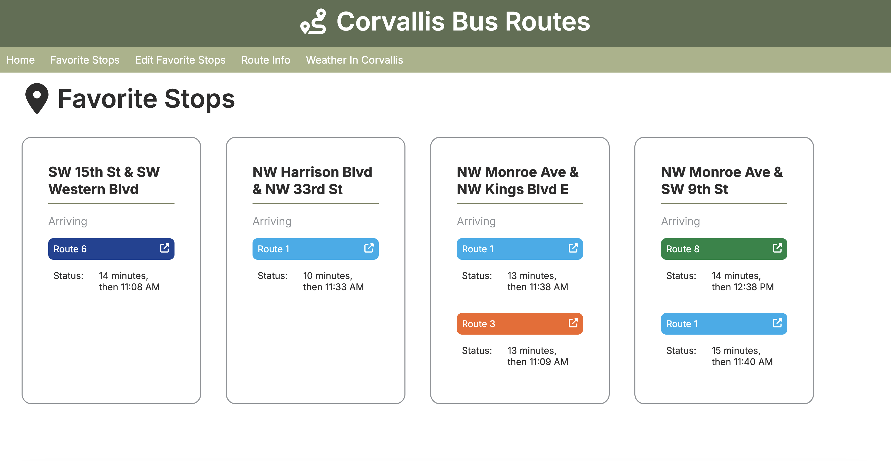
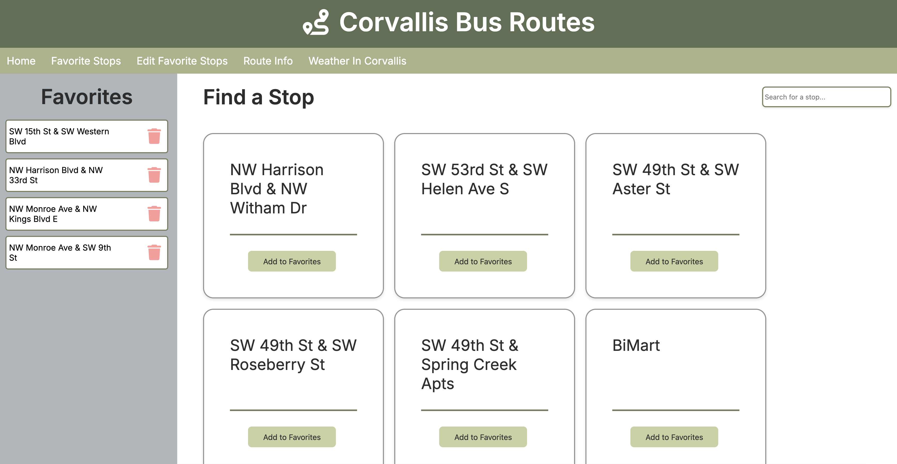
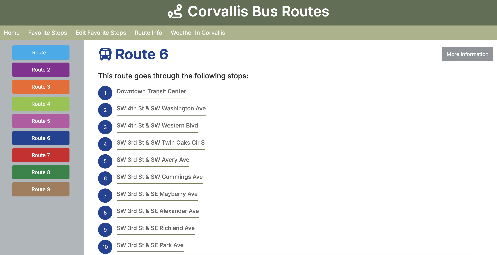

# Corvallis Bus Routes

This website is a prototype of a web app that provides Corvallis residents with helpful information to plan their commute using the Corvallis Transit System buses. It displays route information, allows users to save favorite stops to easily check when buses are arriving, and gives a simple summary of the current weather conditions.

## View Favorite Stops

Users can quickly get information about arriving buses for their favorite stops, including the route numbers and colors, and the estimated arrival time of the buses.

## Select Favorite Stops

Users can search for bus stops and add or delete stops from their favorites list. 

## Route Information

The route information page displays the route color, route number, and the stops along the route. Additionally, there's a link to the route's page on the Corvallis Transit System website for more information.

 

**Please Note:**
This was created as a group final project for a web development course and is not fully fleshed out, nor optimized for mobile devices. Currently, there are no user accounts as this was outside the scope of this course, so favorite stops are not persisted after closing the website.